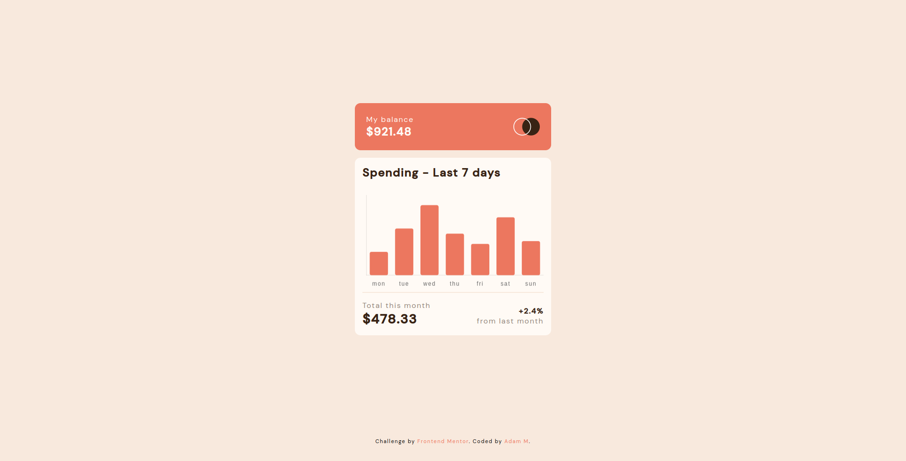

# Frontend Mentor lv2 - Expenses chart component

This is a solution to the [Expenses chart component](https://www.frontendmentor.io/challenges/expenses-chart-component-e7yJBUdjwt). 

## Table of contents

- [The challenge](#the-challenge)
- [Screenshot](#screenshot)
- [Links](#links)
- [Built with](#built-with)
- [Author](#author)

### The challenge

This challenge was to build out this Stats preview card component and get it looking as close to the design as possible. 

Your users should be able to:
- View the bar chart and hover over the individual bars to see the correct amounts for each day
- See the current day's bar highlighted in a different colour to the other bars
- View the optimal layout for the content depending on their device's screen size
- See hover states for all interactive elements on the page
- See dynamically generated bars based on the data provided in the local JSON file

### Screenshot

### Links 

-Live website -[see live](https://adammzkr.github.io/Front-End-Mentor-lvl2/expenses-chart-component/index.html)

### Built with
- Semantic HTML
- Responsive Web Design
- CSS custom properties 
- Flexbox
- JavaScript 
- Chart.js
The chart is generated from JONSON with libray [Chart.js]{https://www.chartjs.org/}

## Author

- Website - [Adam M](https://github.com/AdamMzkr)
- Frontend Mentor - [@AdmMzkr](https://www.frontendmentor.io/profile/AdamMzkr)
- Email - [adm.mzkr@gmail.com](adm.mzkr@gmail.com)

