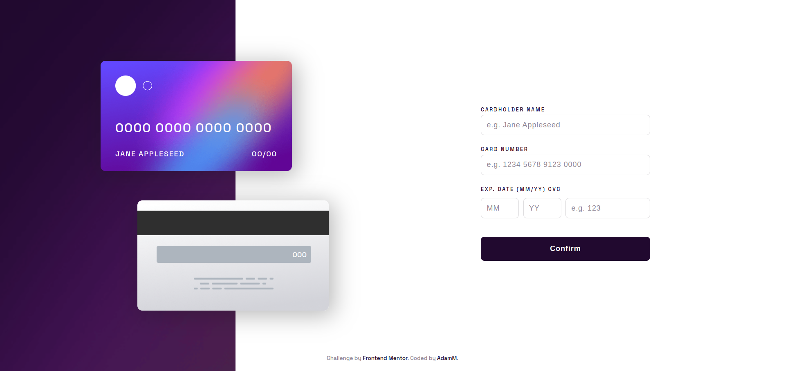
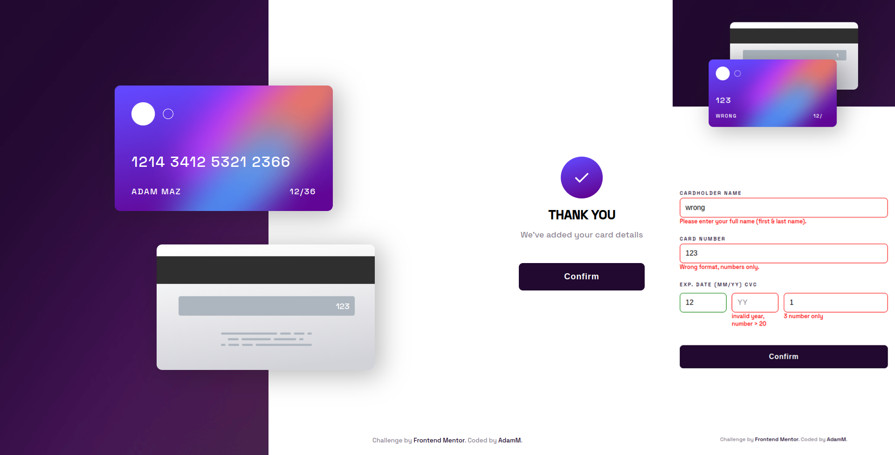

# Frontend Mentor lv2 - Interactive card details form

This is a solution to the [Interactive card details form](https://www.frontendmentor.io/challenges/interactive-card-details-form-XpS8cKZDWw). 

## Table of contents

- [The challenge](#the-challenge)
- [Screenshot](#screenshot)
- [Links](#links)
- [Built with](#built-with)
- [Author](#author)

### The challenge

This challenge was to build out this Stats preview card component and get it looking as close to the design as possible. 

Your users should be able to:

Fill in the form and see the card details update in real-time
- Receive error messages when the form is submitted if:
  - Any input field is empty
  - The card number, expiry date, or CVC fields are in the wrong format
- View the optimal layout depending on their device's screen size
- See hover, active, and focus states for interactive elements on the page

### Screenshot

-state complete and mobile view with validation

### Links 

-Live website -[see live](https://adammzkr.github.io/Front-End-Mentor-lvl2/interactive-card-details/index.html)

### Built with
- Semantic HTML
- Responsive Web Design
- CSS custom properties (position @keyfrmes, animation)
- Flexbox
- JavaScript DOM manipulation
- JavaScript Validation
- Javascript regex expressions

## Author

- Website - [Adam M](https://github.com/AdamMzkr)
- Frontend Mentor - [@AdmMzkr](https://www.frontendmentor.io/profile/AdamMzkr)
- Email - [adm.mzkr@gmail.com](adm.mzkr@gmail.com)
