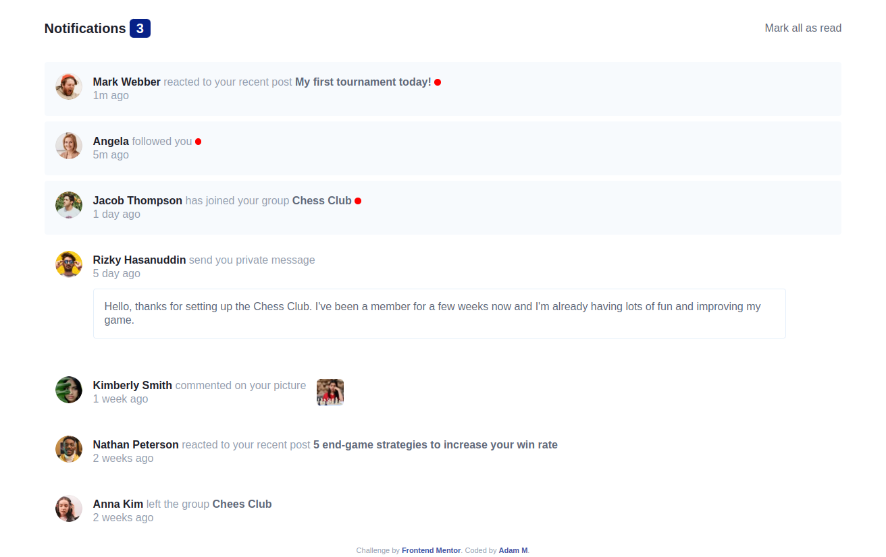

# Frontend Mentor lv2 - Notifications page

This is a solution to the [Notifications page](https://www.frontendmentor.io/challenges/notifications-page-DqK5QAmKbC). 

## Table of contents

- [The challenge](#the-challenge)
- [Screenshot](#screenshot)
- [Links](#links)
- [Built with](#built-with)
- [Author](#author)

### The challenge

This challenge was to build out this Stats preview card component and get it looking as close to the design as possible. 

Your users should be able to:
- Distinguish between "unread" and "read" notifications
- Select "Mark all as read" to toggle the visual state of the unread notifications and set the number of unread messages to zero
- View the optimal layout for the interface depending on their device's screen size
- See hover and focus states for all interactive elements on the page
### Screenshot

### Links 

-Live website -[see live](https://adammzkr.github.io/Front-End-Mentor-lvl2/notificatios-page/index.html)

### Built with
- Semantic HTML
- Responsive Web Design
- CSS custom properties 
- Flexbox
- JavaScript DOM manipulation

## Author

- Website - [Adam M](https://github.com/AdamMzkr)
- Frontend Mentor - [@AdmMzkr](https://www.frontendmentor.io/profile/AdamMzkr)
- Email - [adm.mzkr@gmail.com](adm.mzkr@gmail.com)

