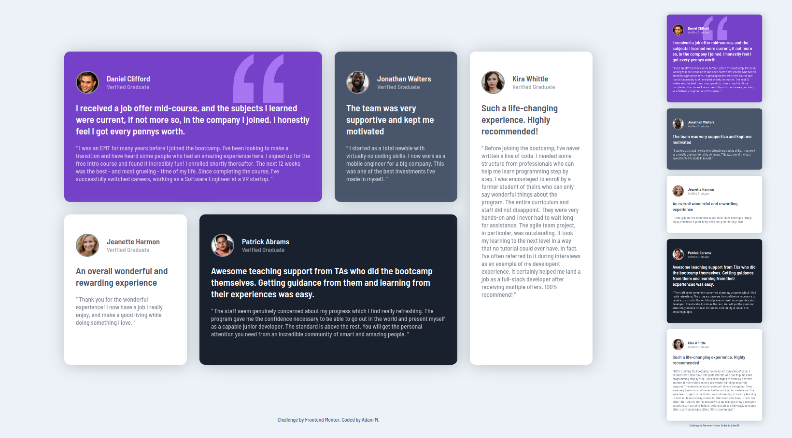

# Frontend Mentor lv2 - Testimonials grid section

This is a solution to the [Testimonials grid section](https://www.frontendmentor.io/challenges/testimonials-grid-section-Nnw6J7Un7). 

## Table of contents

- [The challenge](#the-challenge)
- [Screenshot](#screenshot)
- [Links](#links)
- [Built with](#built-with)
- [Author](#author)

### The challenge
Your challenge is to build out this testimonials grid section and get it looking as close to the design as possible.

Your users should be able to:
- View the optimal layout for the site depending on their device's screen size

### Screenshot

### Links 

-Live website -[see live](https://adammzkr.github.io/Front-End-Mentor-lvl2/testimonials-grid/index.html)

### Built with
- Semantic HTML
- Responsive Web Design
- CSS custom properties 
- Flexbox/GRID

## Author

- Website - [Adam M](https://github.com/AdamMzkr)
- Frontend Mentor - [@AdmMzkr](https://www.frontendmentor.io/profile/AdamMzkr)
- Email - [adm.mzkr@gmail.com](adm.mzkr@gmail.com)

